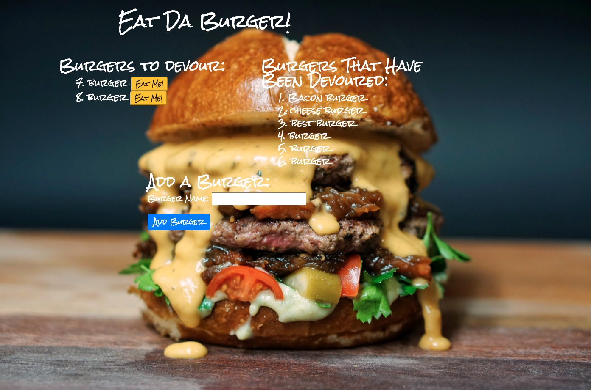

# Burger
Hw 14 - Node Express Handlebars

# Description 
A burger eating application using Node.js, Express, MySQL, and Handlebars. 
This application is my first full stack application with a front end implemented with HTML/CSS and elements from the Materialize framework and the backend implemented with Node.js and Express. HTML templating is achieved by done with the use of Handlebars.

The user may enter any burger name to add to "Burgers to Devour" menu, this also adds the new burger entry into the MySQL database. The initial burger entry is added as available on the menu and placed on the left side of the screen. The user may then eat any burger by clicking on it, which moves into the column right beside it and updates its status accordingly in the database, showing it be have been devoured! 

